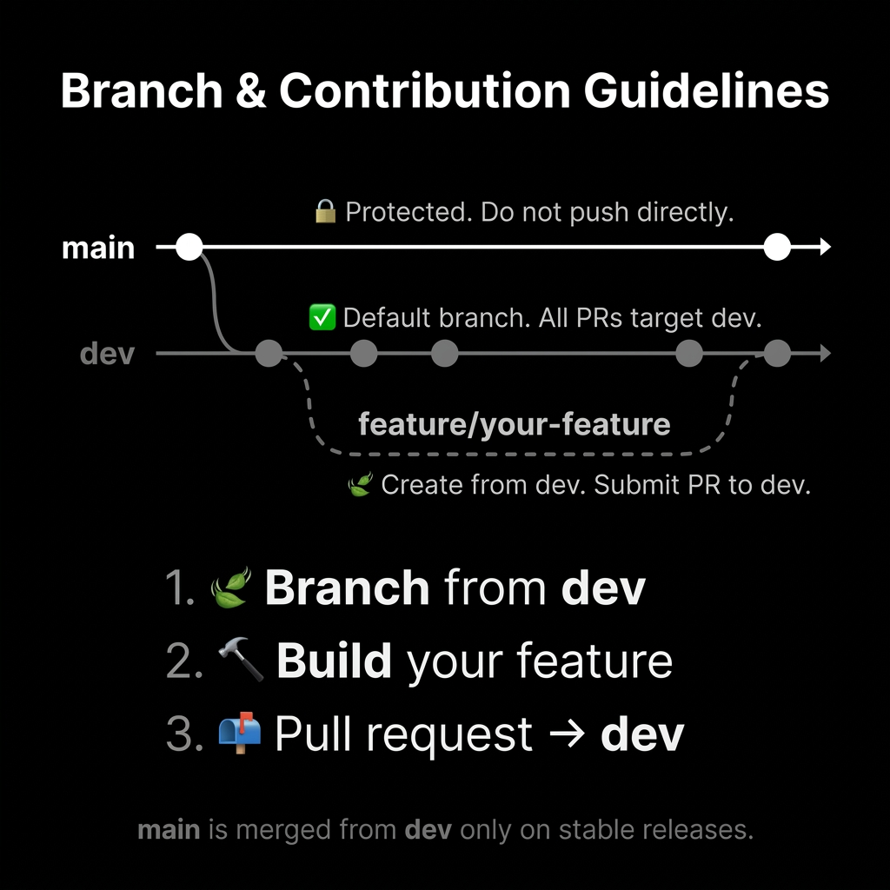
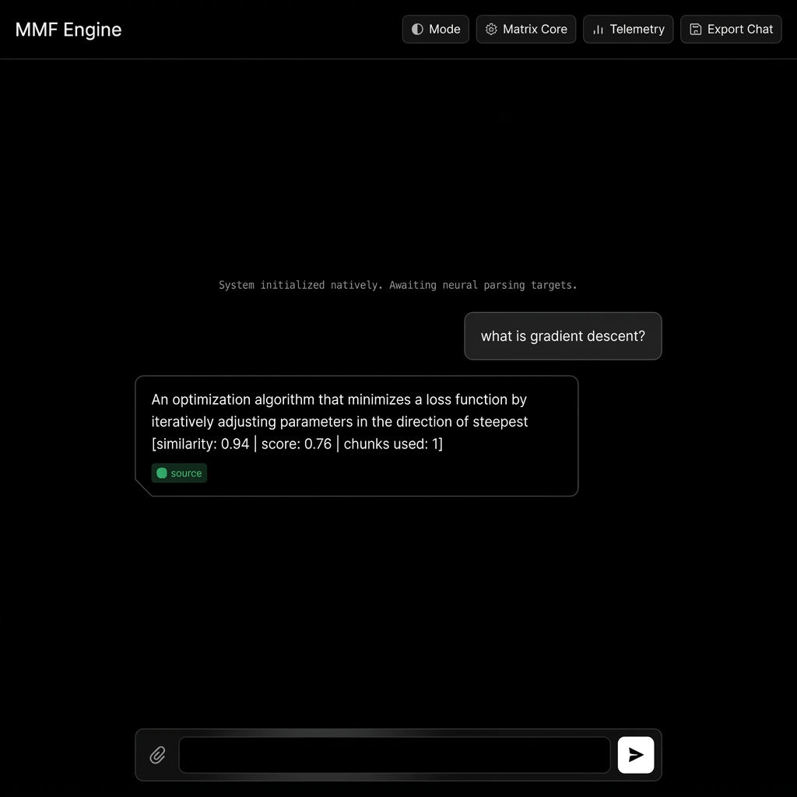
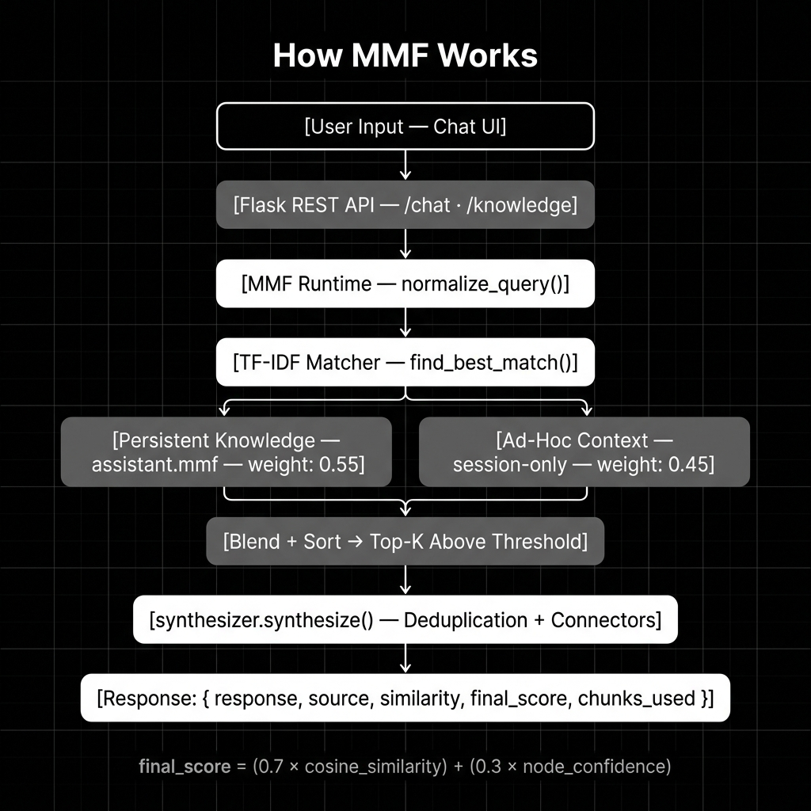
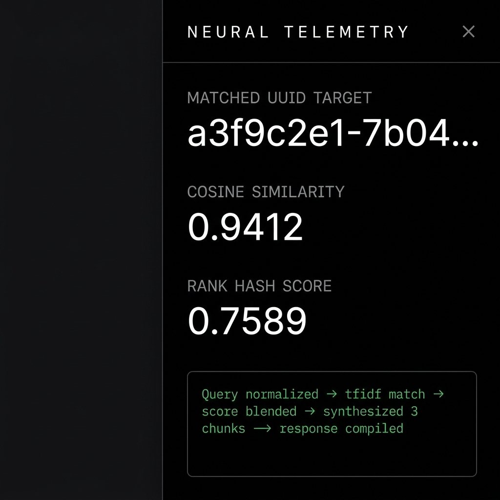

# MMF AI Platform

### Self-learning AI that builds knowledge dynamically — no retraining, no cloud, no API keys.

##  Contribution Guidelines



<div align="center">

[](https://python.org)
[](https://flask.palletsprojects.com)
[](https://scikit-learn.org)
[](LICENSE)

</div>

---

## Overview



Most AI systems require pre-trained models, cloud APIs, or expensive inference hardware. **MMF is different.**

MMF (Memory Model File) is an **Intelligent Semantic Response Engine** (v0.7.1) that learns from your data at runtime. It replaces traditional RAG complexity with a deterministic, lightweight, and intent-aware retrieval pipeline.

**MMF v0.7.1 Upgrades:**
- **Hybrid Intent-Aware Selection**: Prioritizes the correct semantic intent (Implementation, Comparison, Debugging) over raw similarity scores.
- **Master Synthesizer**: Merges Top-3 knowledge nodes into structured, deduplicated, and professional technical responses.
- **Background Learning**: Asynchronously persists chat knowledge in real-time without blocking the user interface.

---

## How MMF Differs From RAG

Standard RAG systems rely on expensive external LLMs for generation. **MMF v0.7.1** implements a **Master Synthesizer** that achieves generative-like results deterministically.

| Component | Traditional RAG | MMF v0.7.1 |
|---|---|---|
| Semantic Search | Neural embeddings (Paid API) | Intent-Aware TF-IDF (CPU, Free) |
| Selection | Raw Vector Match | Hybrid Intent-Aware Fallback |
| Generation | LLM (GPT, Claude) | Master Synthesizer (Rule-based) |
| Update Speed | Continuous Re-indexing | Live Hot-Reload + BG Learning |
| Privacy | Data sent to Cloud | 100% Local / On-Device |

---

## The Intelligent Response Engine (v0.7.1)

MMF is no longer just a retriever. It is a **Controlled Semantic Generator**.

### How it works

**Step 1 — Hybrid Intent Selection**
If you ask for a "stack implementation", MMF recognizes the `implementation` intent and prioritizes code-heavy nodes, even if a "definition" node has a slightly higher raw similarity score.

**Step 2 — Strict Metadata Extraction**
Instead of raw text dumping, MMF parses structured `content_json` to extract:
- **Insight**: The core conceptual summary.
- **Key Points**: Deduplicated bullet points spanning multiple knowledge nodes.
- **Implementation**: Language-aware code blocks (C, Python, C++).

**Step 3 — Controlled Synthesis**
The engine merges Top-3 candidates using a **Primary Node Lock**. The primary node defines the answer, while secondary nodes are strictly filtered by intent to enrich the result without concept contamination or duplication.

---

## Architecture



```
User Input (Chat UI)
        │
        ▼
   MMF Runtime ───▶ [BG LEARNER] (Asynchronous Knowledge Expansion)
        │
        ▼
  Hybrid Intent Matcher
  (Detect: Implementation | Comparison | Debug | Definition)
        │
  ┌─────┴──────────────┐
  │ 1.15x Intent Boost │ ◀── Score Calibration: 0.7*Sim + 0.3*Conf
  └─────┬──────────────┘
        ▼
   Master Synthesizer
   (Primary-Secondary Lock + Structured JSON Extraction)
        │
        ▼
   #### Insight: {Topic}
   summary...
   #### Key Points:
   - point 1 (deduplicated)
   #### Implementation:
   ```python ... ```
```

Context blending weights:
- Persistent MMF knowledge → `× 0.55`
- Session-attached files   → `× 0.45`

---

## Features

- **Semantic Search** — TF-IDF cosine similarity with top-K ranking, soft thresholding, and per-response explainability
- **Response Synthesizer** — Merges multiple retrieved chunks into one coherent answer using deterministic rule-based NLP
- **Self-Learning** — Add, edit, or remove knowledge live in the UI; changes hot-reload without restarting Flask
- **Document Ingestion** — Parse `.pdf`, `.csv`, `.txt`, `.js`, `.sql` into structured semantic nodes
- **Hybrid Query Generator** — Converts raw text chunks into 3–5 retrieval-optimized query variants per node
- **Context-Aware Chat (RAG-style)** — Attach files temporarily; nodes blend into every query without being saved
- **HuggingFace Import** — Pull any public dataset via the HuggingFace Datasets API. No API key required
- **Explainable Outputs** — Every response returns `similarity`, `final_score`, `matched_query`, `source`, `chunks_used`
- **Modern Chat UI** — ChatGPT-style interface, dark/light mode, typing indicators, toast notifications, progress bars
- **Chat Export** — Download any conversation as a structured `.md` file

---

## Screenshots

<div align="center">

| Knowledge Base Manager | Neural Telemetry Panel |
|:---:|:---:|
|  |  |

</div>

---

## Demo Flow

**1 — Ask something the system doesn't know**
```
You: What is gradient descent?
MMF: No suitable knowledge found.
```

**2 — Teach it directly in the UI**
```
⚙️ Matrix Core → + Inject Node
Query:    "what is gradient descent"
Response: "An optimization algorithm that minimizes a loss function by
           iteratively adjusting parameters in the direction of steepest descent."
```

**3 — Ask again**
```
You: what is gradient descent?
MMF: An optimization algorithm that minimizes a loss function by iteratively
     adjusting parameters in the direction of steepest descent.
     [similarity: 0.94 | score: 0.76 | chunks used: 1]
```

**4 — Upload a textbook, ask a multi-chunk question**
```
[+] Attach: ml_textbook.pdf  →  75 nodes extracted

You: Explain backpropagation and how it uses gradient descent
MMF: Backpropagation is an algorithm for computing gradients in neural networks.
     Additionally, it uses the chain rule to propagate error signals backward
     through each layer. Furthermore, these gradients are then applied by
     gradient descent to update the network's weights.
     [📎 From: ml_textbook.pdf | chunks used: 3]
```

---

## Installation

```bash
# Clone the repo
git clone https://github.com/Rohan-Boddu/mmf
cd mmf

# Install dependencies (no GPU, no CUDA, no downloads > 50MB)
pip install -r requirements.txt

# Start the engine
python backend/app.py
```

Open `frontend/index.html` in your browser. Flask runs on `http://localhost:5000`.

---

## Project Structure

```
mmf/
│
├── backend/
│   ├── app.py                   # Flask factory — CORS, blueprint registration
│   ├── mmf/
│   │   ├── runtime.py           # Orchestrates: query → retrieve → synthesize → respond
│   │   ├── matcher.py           # TF-IDF engine + ephemeral ad-hoc context blending
│   │   ├── synthesizer.py       # Rule-based response synthesizer (multi-chunk fusion)
│   │   ├── learner.py           # Deduplication, merging, atomic persistence
│   │   ├── ingestor.py          # Multi-format document parser
│   │   ├── query_generator.py   # Zero-dependency semantic query expander
│   │   ├── builder.py           # Compiles mmf_dev/ → assistant.mmf ZIP binary
│   │   ├── loader.py            # Loads .mmf binary into memory
│   │   ├── extractor.py         # Heuristic NLP pattern extraction
│   │   └── processor.py         # Text normalization utilities
│   └── routes/
│       ├── chat.py              # /chat · /chat/context
│       └── knowledge.py         # CRUD · ingest · export · bulk ops · HuggingFace
│
├── frontend/
│   ├── index.html               # UI shell — modals, context strip, panels
│   ├── style.css                # Design system — glassmorphism, toasts, progress bars
│   └── script.js                # UI logic — context, chat export, CRUD, bulk ops
│
├── main.py                      # Entry point — builds .mmf and starts Flask
├── requirements.txt
├── AGENT_RULES.md               # Architecture governance rules
└── CHANGELOG.md                 # Full version history
```

---

## API Reference

| Method | Endpoint | Description |
|---|---|---|
| `POST` | `/api/chat` | Query the engine (supports `ad_hoc_knowledge` array) |
| `POST` | `/api/chat/context` | Extract nodes from a file for session-wide context |
| `GET` | `/api/knowledge` | List all knowledge nodes |
| `POST` | `/api/knowledge` | Add a single node |
| `PUT` | `/api/knowledge/<id>` | Update a node |
| `DELETE` | `/api/knowledge/<id>` | Delete a node |
| `POST` | `/api/knowledge/bulk-delete` | Delete multiple nodes by ID |
| `POST` | `/api/knowledge/ingest` | Ingest a document file |
| `POST` | `/api/knowledge/csv-headers` | Peek at CSV column names |
| `GET` | `/api/knowledge/export` | Download `assistant.mmf` binary |
| `GET` | `/api/knowledge/export/nodes` | Download all nodes as CSV |
| `POST` | `/api/knowledge/import` | Upload and replace with a `.mmf` binary |
| `POST` | `/api/knowledge/import/huggingface` | Import rows from a HuggingFace dataset |

---

## Why This Project Matters

**No retraining.** Add, correct, or remove knowledge instantly through the UI. The engine hot-reloads in milliseconds. This is architecturally impossible with fine-tuned or pre-trained models.

**Lightweight AI alternative.** Runs on any laptop. No GPU, no 70GB model downloads, no Docker, no cloud account. The `.mmf` binary is a ZIP — portable, versionable, shareable.

**Generative without an LLM.** The rule-based synthesizer fuses multiple retrieved chunks into coherent, connected responses. When you're ready to upgrade to an LLM, you swap one function — the retrieval pipeline stays identical.

**Explainable by default.** Every response tells you which query matched, what the cosine similarity was, what the final score was, and how many chunks were used. There are no black boxes.

**Modular by design.** Every component has strict bounded responsibilities. Swapping TF-IDF for FAISS, adding auth, or wiring in Ollama requires changes to exactly one file each.

---

## Roadmap

- [ ] **LLM Generation Layer** — Send retrieved chunks to Ollama / OpenAI / Gemini for fluent, grounded answers(optional)
- [ ] **Rule-Based Response Synthesizer** — Implement a lightweight generation layer to combine top-k retrieved chunks into coherent, human-readable answers                                                    without relying on LLMs.
- [ ] **Neural Embeddings** — Replace TF-IDF with `sentence-transformers` for deep semantic similarity
- [ ] **FAISS Vector Index** — Scale to millions of nodes without memory pressure
- [ ] **Streaming Responses** — Server-sent events for real-time token output
- [ ] **Multi-User Sessions** — Isolated session contexts with lightweight auth

---

## License

MIT — see [LICENSE](LICENSE).

---

## Author

**Rohan Boddu**
Built as an exploration of production-grade AI knowledge systems without model dependencies — proving that intelligent retrieval, dynamic learning, and explainability don't require a pre-trained model.

---

<div align="center">
<sub>No cloud. No retraining. No black boxes.</sub>
</div>
