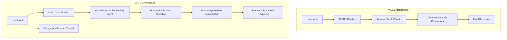

# MMF: The Self-Learning AI Knowledge Engine

**MMF (Memory Model File) is an intelligent, zero-dependency semantic engine designed to transform raw data into a structured, on-device knowledge base—delivering human-like reasoning and real-time learning without the need for cloud APIs or expensive model retraining.**

---

## 🚀 Version Evolution & Insights

---

## 🚀 v0.7.1 — The "Intelligent Release" (Current)
*April 2026*

The current version marks the transition of MMF from a high-performance **Retrieval System** to an **Intelligent Semantic Response Engine**. It no longer just finds text; it synthesizes and reasons based on intent.

### 🧠 Core Upgrades

#### 1. Hybrid Intent-Aware Selection
MMF v0.7.1 introduces a proprietary intent classification layer. Instead of relying solely on TF-IDF similarity scores, it detects the **Intent** of the user query:
- **Categories**: Definition, Comparison, Debugging, Explanation, Implementation.
- **Boost Logic**: 
    - **1.3x Intent Boost**: If intent matches node type.
    - **1.2x Language Match**: If a specific programming language is requested.
- **promotion Strategy**: If the best match doesn't match the intent, it checks the Top-3. An intent-matching node within 95% of the top score is automatically promoted to "Primary" status.

#### 2. Master Synthesizer v2
Replaced naive chunk concatenation with a **Primary-Secondary Lock Architecture**:
- **Primary Node Lock**: The highest scoring node defines the core "Insight" and "Summary". 
- **Dynamic Formatting**: Based on intent, it constructs different structures:
    - **Comparison**: Injects a `#### Reasoning` block from the `reasoning_map` metadata (Problem → Solution → Tradeoffs).
    - **Steps**: Appends `#### Execution Steps` for precise algorithmic walkthroughs.
    - **Implementation**: Injects language-specific code blocks extracted from `content_json`.
- **Deduplication**: Strictly removes redundant points between nodes while preserving semantic order.

#### 3. SparkLight Algorithmic Suite
Integrated 23+ advanced data structures and algorithms from the SparkLight project, including:
- **Complex Trees**: Red-Black, AVL, Splay, and B-Trees.
- **Advanced Hashing**: Quadratic Probing, Double Hashing, Rehashing.
- **Graph & Strings**: BFS/DFS, Infix-to-Postfix conversion.

#### 4. Asynchronous Background Learning
The chat pipeline is now non-blocking. As you chat, the **BG Learner** thread processes and persists knowledge in real-time. The system learns as you interact, without any UI lag.

---

## 🛠️ v0.6.1 — The "Infrastructure Hub"
*Prior Stable Release*

v0.6.1 laid the groundwork for robust document ingestion and context-aware session management.

### ✨ Key Features

#### 1. Hybrid Query Generator
A breakthrough in zero-dependency semantic expansion. It converts every ingested knowledge node into **3–5 retrieval-optimized query variants** using pattern-based NLP, dramatically increasing hit rates for natural language questions.

#### 2. Multi-Format Ingestor 2.0
- **PDF Splitter**: Paragraph-boundary splitting for dense technical PDFs.
- **CSV Column Mapping**: First-of-its-kind "Column Peek" API allowing users to map any header layout to Query/Response pairs.
- **Extensible Support**: Deep parsing for `.txt`, `.csv`, `.js`, `.sql`, and `.pdf`.

#### 3. Chat Context (Ad-Hoc Blending)
Introduced the `[+]` button to attach session-only files.
- **Blending Weight**: 55% MMF Knowledge / 45% Ephemeral File Context.
- **Source Attribution**: Instant visual feedback on where an answer came from (Matrix vs. Attached File).

#### 4. UI/UX Overhaul
- **Toast Notifications**: Replaced native browser alerts with premium, non-blocking toast signals.
- **Progress Overlays**: Deterministic progress bars for long-running PDF ingestions.
- **Bulk Operations**: Multi-node selection and atomic bulk deletion/export.

---

## 📊 Technical Comparison

| Feature | v0.6.1 (Stable) | v0.7.1 (Active) |
| :--- | :--- | :--- |
| **Logic Type** | Pure Retrieval | **Intent-Aware Synthesis** |
| **Selection Algorithm** | Best Match Similarity | **Hybrid Intent-Score Calibration** |
| **Generation Layer** | Pattern Concatenation | **Master Synthesizer (Primary Lock)** |
| **Persistence** | Main Thread | **Asynchronous Background Learning** |
| **Schema** | Flat Text/Markdown | **Structured JSON (`content_json`)** |
| **Thresholding** | Static 0.55 | **Dynamic (0.60 Base / 0.55 Fallback)** |
| **Knowledge Base** | General Purpose | **Optimized for Algorithms & Implementation** |

---

## 🔍 MMF vs. Traditional AI vs. Web Browsers

To understand the value of MMF, it is helpful to compare it against the two standard ways we find information today: static AI models and traditional web browsers.

| Feature | **MMF (Self-Learning)** | **Traditional Model (LLM)** | **Browser (Search)** |
| :--- | :--- | :--- | :--- |
| **Learning Path** | **Instant Ingestion**: Add facts in real-time. No training. | **Pre-trained**: Requires weeks of compute and retraining. | **Static Index**: Relies on what has been crawled by others. |
| **Accuracy** | **Deterministic**: 0% hallucination. Uses your exact data. | **Probabilistic**: High risk of confident hallucinating. | **Source Dependent**: Highly variable quality. |
| **Hardware** | **Lightweight**: Runs on a budget laptop (CPU only). | **Heaveweight**: Requires high-end VRAM/GPUs. | **Cloud Reliant**: Requires constant connection. |
| **Privacy** | **Air-Gapped**: 100% local. Data never leaves your disk. | **Cloud-Tied**: Usually sends data to third-party servers. | **Tracked**: Full reliance on search history and cookies. |
| **Logic** | **Intent-Aware Synthesis**: Reasons across your nodes. | **Black Box**: Logic is hidden within billons of weights. | **Keyword Match**: Purely matches strings to URLs. |

---

## ✅ Advantages vs. ⚠️ Limitations

| Aspect | **Advantages (Pros)** | **Limitations (Cons)** |
| :--- | :--- | :--- |
| **Trust** | **Zero Hallucination**: Only reports what is in memory. | **Closed World**: Can't answer what it hasn't been taught. |
| **Speed** | **Instant Ingestion**: Learned logic is active in milliseconds. | **Synthesis**: Structure-first, not "creative" writing. |
| **Cost** | **Free Forever**: No API fees, no GPU requirements. | **Semantic Depth**: Relies on keyword-adjacent overlap. |
| **Privacy** | **100% On-Device**: Absolute data sovereignty. | **Empty State**: Starts as a "blank slate" knowledge hub. |

---

## 🏗️ Architectural Evolution

> [!TIP]
> **Pro Tip for v0.7.1**: Use specific keywords like "implementation" or "compare" to trigger the Intent-Aware booster for more targeted responses.

> [!IMPORTANT]
> **Data Integrity**: v0.7.1 uses the new `content_json` schema. While compatible with old nodes, we recommend re-ingesting critical data to leverage the new structured fields like `execution_steps` and `variants`.
